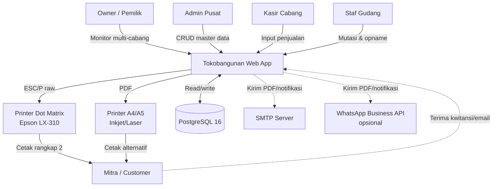
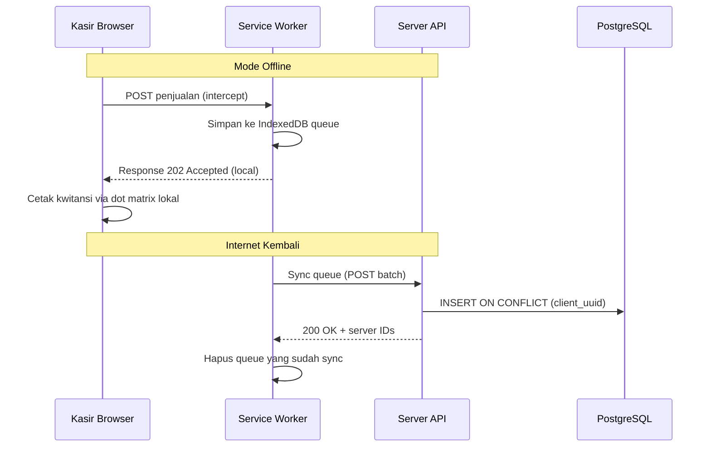
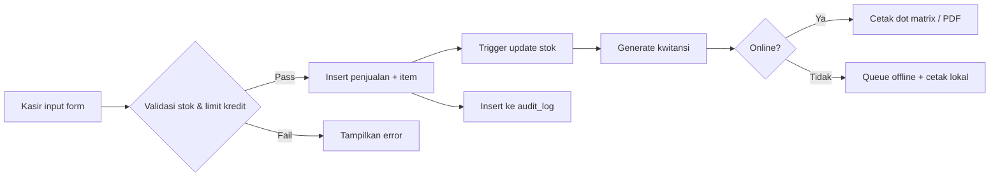
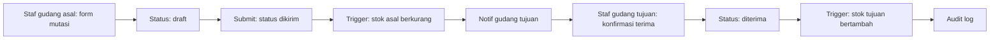
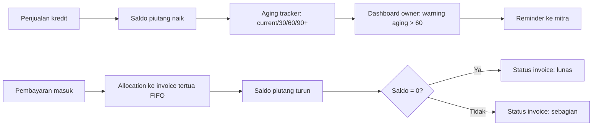

# 02 — System Design

## Diagram Konteks



## Modul Aplikasi

| Modul | Tabel Utama | Fungsi |
|-------|-------------|--------|
| Auth & RBAC | `user`, `session`, `role` | Login, otorisasi per role |
| Master Data | `gudang`, `produk`, `satuan`, `mitra`, `supplier`, `harga_produk` | CRUD master, history harga |
| Penjualan | `penjualan`, `penjualan_item` | Input transaksi, cetak kwitansi |
| Pembayaran | `pembayaran` | Catat pembayaran mitra |
| Stok | `stok` | Stok real-time per cabang per produk |
| Mutasi Gudang | `mutasi_gudang`, `mutasi_item` | Transfer barang antar cabang |
| Stok Opname | `stok_opname`, `stok_opname_item` | Cek fisik vs sistem, adjustment |
| Hutang Supplier | `pembelian`, `pembelian_item`, `pembayaran_supplier` | Tracking hutang |
| Tabungan Mitra | `tabungan_mitra` | Opsional (Canggu, Sayan) |
| Laporan | View / aggregate | LR, penjualan, piutang aging, mutasi |
| Audit | `audit_log` | Track semua perubahan |

## Hybrid Online / Offline

### Strategi

- Default **online** — request langsung ke server, response real-time
- Saat offline — transaksi disimpan di **IndexedDB** browser dengan `client_uuid` (UUIDv7)
- Saat online kembali — service worker auto-sync queue ke server
- Server **idempotent** insert via `ON CONFLICT (client_uuid) DO NOTHING`

### Flow Offline



### Yang Bisa Offline

| Operasi | Offline-able |
|---------|--------------|
| Login | Tidak (perlu sesi server) |
| Lihat master produk/mitra | Ya (cache) |
| Input penjualan | Ya |
| Cetak kwitansi (dot matrix lokal) | Ya |
| Lihat stok real-time multi-cabang | Tidak (data live dari server) |
| Mutasi gudang | Tidak (perlu approval real-time) |
| Pembayaran | Ya |
| Laporan | Tidak |

## Integrasi Print

### Dot Matrix (Default Produksi)

- Output: stream byte ESC/P raw
- Format: fixed-width text dengan koordinat presisi
- Kertas: NCR pre-printed 1/2 folio (vendor cetak kop & kolom; software hanya isi field)
- Driver Linux: `lp -d EpsonLX310 -o raw`
- Driver Windows (kasir): direct USB via JavaScript (Web USB API) atau spool file
- Konfigurasi koordinat per template di tabel `printer_template`

### PDF A5 (Fallback & Email)

- Library: `gofpdf`
- Layout: A5 portrait, kop toko di header, footer tanda tangan + tempat materai
- Watermark: "ASLI" untuk customer copy, "TEMBUSAN" untuk arsip
- Output: bytes → response HTTP `application/pdf` atau attach email

### Terbilang Indonesia

Library Go custom di `internal/terbilang/`:

```go
package terbilang

func Konversi(n int64) string
// 1_250_000 → "Satu juta dua ratus lima puluh ribu rupiah"
```

Edge case: nol, "se" untuk seribu/seratus, kapitalisasi awal kata.

## Data Flow Utama

### Flow 1: Penjualan ke Mitra



### Flow 2: Mutasi Antar Gudang



### Flow 3: Piutang & Pembayaran



## Deployment Topology (Untuk Referensi, Diaktifkan di Fase 9)

```
                    INTERNET
                       |
                  Caddy (HTTPS)
                       |
          +------------v------------+
          |   Go App (Echo)         |
          |   :8080                 |
          +------------+------------+
                       |
          +------------v------------+
          |   PostgreSQL 16         |
          |   :5432                 |
          +-------------------------+

  Backup harian: pg_dump → object storage
```

Deployment detail di `08-security.md` section Backup & `01-plan.md` Fase 9.

## Skalabilitas

- **Vertikal dulu** — VPS Hostinger 4 vCPU / 8GB cukup untuk 5 cabang × 100 transaksi/hari
- **DB partitioning** — `penjualan` di-partition by tahun (RANGE) sejak awal
- **Indeks** — sudah dirancang untuk query 95th percentile
- **Read replica** — Fase 10+ jika perlu (laporan berat di replica, OLTP di master)

## Observability

- **Logging**: structured JSON via `slog`, level INFO default, DEBUG via env
- **Metrics**: Prometheus endpoint `/metrics` (Fase 9)
- **Health check**: `/healthz` (DB ping) untuk monitoring
- **Error tracking**: Sentry atau self-hosted GlitchTip (Fase 9)
