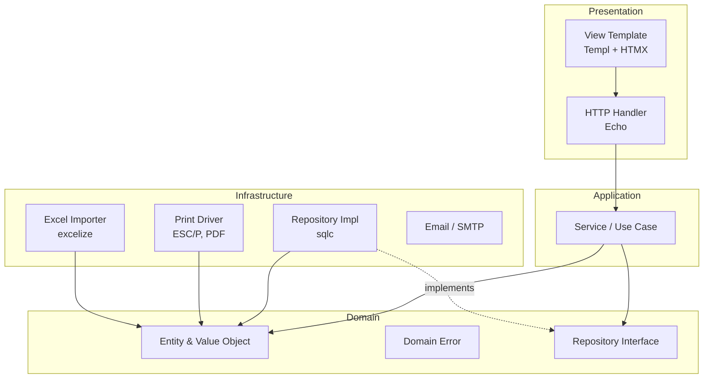

# 03 — Layered Architecture

## Prinsip Utama

Aplikasi disusun dengan layered architecture yang memisahkan tanggung jawab berdasarkan abstraction level. Aturan dependency: **layer atas boleh depend ke layer bawah, tidak sebaliknya**.

## Diagram Layer



## Layer Detail

### 1. Presentation Layer

**Tanggung jawab:** terima HTTP request, parse input, panggil service, render response.

**Komponen:**
- HTTP handler — method per route, return Templ component atau JSON
- View template — `.templ` file, type-safe rendering
- Static asset — CSS, JS, font, icon

**Aturan:**
- Tidak ada business logic
- Tidak akses DB langsung
- Validasi format input (bukan business validation) menggunakan struct tag + `validator/v10`
- Error dari service di-translate ke HTTP status code yang sesuai

**Contoh:**

```go
// internal/handler/penjualan.go
func (h *PenjualanHandler) Create(c echo.Context) error {
    var input dto.PenjualanCreateInput
    if err := c.Bind(&input); err != nil {
        return c.Render(http.StatusBadRequest, view.ErrorAlert("Input tidak valid"))
    }
    if err := input.Validate(); err != nil {
        return c.Render(http.StatusUnprocessableEntity, view.ValidationErrors(err))
    }

    penjualan, err := h.service.Create(c.Request().Context(), input)
    if err != nil {
        return h.translateError(c, err)
    }

    return c.Render(http.StatusOK, view.PenjualanDetail(penjualan))
}
```

### 2. Application / Service Layer

**Tanggung jawab:** orchestrate business logic, transaction management, validasi business rule.

**Komponen:**
- Service — satu service per agregat (PenjualanService, MutasiService, dll)
- DTO — input/output struct untuk komunikasi dengan handler

**Aturan:**
- Semua mutasi DB dalam 1 transaction
- Validasi business rule (cek stok, limit kredit, dll)
- Tidak tahu detail HTTP atau template
- Return domain error, bukan HTTP error

**Contoh:**

```go
// internal/service/penjualan.go
func (s *PenjualanService) Create(ctx context.Context, input dto.PenjualanCreateInput) (*domain.Penjualan, error) {
    return s.tx.RunInTx(ctx, func(ctx context.Context) (*domain.Penjualan, error) {
        mitra, err := s.mitraRepo.GetByID(ctx, input.MitraID)
        if err != nil {
            return nil, fmt.Errorf("ambil mitra: %w", err)
        }

        if err := s.checkLimitKredit(ctx, mitra, input.Total); err != nil {
            return nil, err
        }

        if err := s.checkStok(ctx, input.GudangID, input.Items); err != nil {
            return nil, err
        }

        penjualan, err := s.repo.Create(ctx, input.ToEntity())
        if err != nil {
            return nil, fmt.Errorf("simpan penjualan: %w", err)
        }

        if err := s.audit.Log(ctx, "penjualan", "CREATE", penjualan); err != nil {
            return nil, err
        }

        return penjualan, nil
    })
}
```

### 3. Domain Layer

**Tanggung jawab:** core business concept dan rule yang independent dari teknologi.

**Komponen:**
- Entity — `Penjualan`, `Mitra`, `Produk`, dll (Go struct dengan method)
- Value object — `Uang`, `Qty`, `KodeMitra`
- Domain error — sentinel error (`ErrLimitKreditTerlampaui`, `ErrStokTidakCukup`)
- Repository interface — kontrak untuk akses data

**Aturan:**
- **Tidak depend ke library eksternal** (selain `time`, `errors`, dll standar)
- Pure Go, mudah di-unit-test tanpa mock
- Method entity menerapkan invariant (validasi internal)

**Contoh:**

```go
// internal/domain/penjualan.go
package domain

type Penjualan struct {
    ID            int64
    NomorKwitansi string
    Tanggal       time.Time
    MitraID       int64
    GudangID      int64
    Items         []PenjualanItem
    Subtotal      Uang
    Diskon        Uang
    Total         Uang
    StatusBayar   StatusBayar
}

func (p *Penjualan) Validate() error {
    if len(p.Items) == 0 {
        return ErrPenjualanKosong
    }
    if p.Total.Lebih(p.Subtotal) {
        return ErrTotalLebihDariSubtotal
    }
    return nil
}

func (p *Penjualan) HitungTotal() {
    var sub Uang
    for _, item := range p.Items {
        sub = sub.Plus(item.Subtotal)
    }
    p.Subtotal = sub
    p.Total = sub.Minus(p.Diskon)
}
```

### 4. Repository Layer (Infrastructure)

**Tanggung jawab:** implementasi akses data, query SQL via sqlc.

**Aturan:**
- Implements interface dari domain layer
- Tidak mengandung business logic
- Mapping antara Go struct dan database row
- Handle error DB (translate ke domain error untuk kasus tertentu)

**Contoh:**

```go
// internal/repo/penjualan.go
type penjualanRepo struct {
    q *db.Queries
}

func (r *penjualanRepo) Create(ctx context.Context, p *domain.Penjualan) (*domain.Penjualan, error) {
    row, err := r.q.InsertPenjualan(ctx, db.InsertPenjualanParams{
        NomorKwitansi: p.NomorKwitansi,
        Tanggal:       p.Tanggal,
        MitraID:       p.MitraID,
        GudangID:      p.GudangID,
        Subtotal:      p.Subtotal.Cents(),
        Diskon:        p.Diskon.Cents(),
        Total:         p.Total.Cents(),
        StatusBayar:   string(p.StatusBayar),
        ClientUuid:    p.ClientUUID,
    })
    if err != nil {
        if pgErr := pgErrCode(err); pgErr == "23505" { // unique violation
            return nil, domain.ErrDuplikatTransaksi
        }
        return nil, fmt.Errorf("insert penjualan: %w", err)
    }

    p.ID = row.ID
    return p, nil
}
```

### 5. Infrastructure Layer (Lain-Lain)

Komponen non-DB:

- **Print driver** (`internal/print/escpos`, `internal/print/pdf`) — convert domain entity ke output bytes
- **Excel importer** (`internal/importer/excel`) — parse Excel, return slice of domain entity
- **Email sender** (`internal/email`) — kirim PDF via SMTP
- **Auth** (`internal/auth`) — Argon2id hash, session store

## Struktur Folder Source Code

Akan dibuat di Fase 1, sebagai referensi:

```
tokobangunan/
├── cmd/
│   ├── server/main.go              # Web app entry
│   └── migrate-excel/main.go       # One-shot importer
├── internal/
│   ├── domain/                     # Entity, error, interface
│   │   ├── penjualan.go
│   │   ├── mutasi.go
│   │   └── ...
│   ├── service/                    # Business logic
│   │   ├── penjualan.go
│   │   └── ...
│   ├── repo/                       # Repository impl
│   │   ├── penjualan.go
│   │   └── ...
│   ├── handler/                    # HTTP handler
│   │   ├── penjualan.go
│   │   └── ...
│   ├── view/                       # Templ template
│   │   ├── layout.templ
│   │   └── penjualan/
│   ├── dto/                        # Input/output DTO
│   ├── print/
│   │   ├── escpos/
│   │   └── pdf/
│   ├── terbilang/
│   ├── auth/
│   ├── audit/
│   └── importer/excel/
├── db/
│   ├── migrations/                 # SQL migration files
│   ├── queries/                    # sqlc query files
│   └── sqlc.yaml
└── web/
    ├── static/                     # CSS, JS, font, icon
    └── tailwind.config.js
```

## Aturan Tambahan

### Dependency Injection

- Constructor-based DI (no global state, no DI framework)
- Wire dependencies di `cmd/server/main.go`
- Service menerima interface, bukan concrete

### Context Propagation

- Setiap method menerima `context.Context` sebagai parameter pertama
- Pass context dari handler → service → repo
- Cancel propagation otomatis kalau client disconnect

### Transaction Boundary

- Service layer yang menentukan transaction boundary
- Pakai helper `tx.RunInTx(ctx, fn)` yang auto-rollback on error
- Jangan buka transaction di handler atau repo

### Testing per Layer

| Layer | Test Type | Tools |
|-------|-----------|-------|
| Domain | Unit | `testing`, table-driven |
| Service | Unit (mock repo) | `testing`, `gomock` atau hand-written mock |
| Repo | Integration | `testing`, `testcontainers-go` (Postgres real) |
| Handler | Integration | `httptest`, real service + repo |
| End-to-end | Browser | `chromedp` atau Playwright (Fase 8) |
