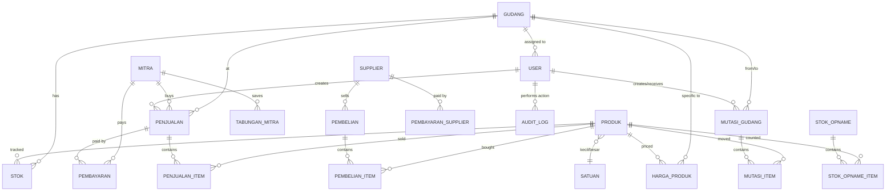

# 06 — Database Schema

PostgreSQL 16. Migrasi via `golang-migrate`. Query via `sqlc` (type-safe Go code generated dari SQL).

## Konvensi

- Nama tabel: `snake_case`, singular (`penjualan`, bukan `penjualans`)
- Primary key: `id BIGSERIAL` di setiap tabel
- Timestamp: `created_at TIMESTAMPTZ NOT NULL DEFAULT now()`, `updated_at TIMESTAMPTZ NOT NULL DEFAULT now()` di setiap tabel
- Soft delete: `deleted_at TIMESTAMPTZ NULL` untuk master data (produk, mitra, supplier)
- Mata uang: `BIGINT` cents (1 = Rp 0.01) untuk hindari float rounding
- UUID: `UUID` type native PostgreSQL (untuk `client_uuid`)
- JSON: `JSONB` (bukan `JSON`)
- Trigger update `updated_at` otomatis via function `set_updated_at()`

## ERD



## Tabel Master

### `gudang`

```sql
CREATE TABLE gudang (
    id          BIGSERIAL PRIMARY KEY,
    kode        TEXT NOT NULL UNIQUE,           -- CANGGU, SAYAN, PEJENG, SAMPLANGAN, TEGES
    nama        TEXT NOT NULL,
    alamat      TEXT,
    telepon     TEXT,
    is_active   BOOLEAN NOT NULL DEFAULT TRUE,
    created_at  TIMESTAMPTZ NOT NULL DEFAULT now(),
    updated_at  TIMESTAMPTZ NOT NULL DEFAULT now()
);
```

### `satuan`

```sql
CREATE TABLE satuan (
    id          BIGSERIAL PRIMARY KEY,
    kode        TEXT NOT NULL UNIQUE,           -- sak, kg, batang, m, m2, lusin, biji
    nama        TEXT NOT NULL,
    created_at  TIMESTAMPTZ NOT NULL DEFAULT now()
);

INSERT INTO satuan (kode, nama) VALUES
    ('sak', 'Sak'),
    ('kg', 'Kilogram'),
    ('batang', 'Batang'),
    ('m', 'Meter'),
    ('m2', 'Meter Persegi'),
    ('lusin', 'Lusin'),
    ('biji', 'Biji'),
    ('roll', 'Roll'),
    ('lembar', 'Lembar');
```

### `produk`

```sql
CREATE TABLE produk (
    id                  BIGSERIAL PRIMARY KEY,
    sku                 TEXT NOT NULL UNIQUE,
    nama                TEXT NOT NULL,
    kategori            TEXT,
    satuan_kecil_id     BIGINT NOT NULL REFERENCES satuan(id),
    satuan_besar_id     BIGINT REFERENCES satuan(id),
    faktor_konversi     NUMERIC(12, 4) NOT NULL DEFAULT 1,    -- 1 satuan_besar = N satuan_kecil
    stok_minimum        NUMERIC(14, 4) NOT NULL DEFAULT 0,
    is_active           BOOLEAN NOT NULL DEFAULT TRUE,
    deleted_at          TIMESTAMPTZ NULL,
    created_at          TIMESTAMPTZ NOT NULL DEFAULT now(),
    updated_at          TIMESTAMPTZ NOT NULL DEFAULT now()
);

CREATE INDEX idx_produk_nama_trgm ON produk USING gin (nama gin_trgm_ops);
CREATE INDEX idx_produk_active ON produk(is_active) WHERE deleted_at IS NULL;
```

Catatan: `faktor_konversi` untuk konversi sak↔kg, batang↔meter, dll. Menggantikan hardcode `/5.5` di Excel.

### `harga_produk`

History harga dengan tipe (eceran/grosir/proyek) per gudang.

```sql
CREATE TABLE harga_produk (
    id              BIGSERIAL PRIMARY KEY,
    produk_id       BIGINT NOT NULL REFERENCES produk(id),
    gudang_id       BIGINT NULL REFERENCES gudang(id),    -- NULL = semua gudang
    tipe            TEXT NOT NULL,                          -- eceran, grosir, proyek
    harga_jual      BIGINT NOT NULL,                        -- cents
    berlaku_dari    DATE NOT NULL,
    created_at      TIMESTAMPTZ NOT NULL DEFAULT now(),
    UNIQUE (produk_id, gudang_id, tipe, berlaku_dari)
);

CREATE INDEX idx_harga_lookup ON harga_produk(produk_id, gudang_id, tipe, berlaku_dari DESC);
```

Query harga aktif: ambil row terbaru `berlaku_dari <= today` untuk produk+gudang+tipe.

### `mitra`

```sql
CREATE TABLE mitra (
    id                  BIGSERIAL PRIMARY KEY,
    kode                TEXT NOT NULL UNIQUE,
    nama                TEXT NOT NULL,
    alamat              TEXT,
    kontak              TEXT,
    npwp                TEXT,
    tipe                TEXT NOT NULL,                      -- eceran, grosir, proyek
    limit_kredit        BIGINT NOT NULL DEFAULT 0,         -- cents, 0 = tanpa limit
    jatuh_tempo_hari    INTEGER NOT NULL DEFAULT 30,
    gudang_default_id   BIGINT REFERENCES gudang(id),
    catatan             TEXT,
    is_active           BOOLEAN NOT NULL DEFAULT TRUE,
    deleted_at          TIMESTAMPTZ NULL,
    created_at          TIMESTAMPTZ NOT NULL DEFAULT now(),
    updated_at          TIMESTAMPTZ NOT NULL DEFAULT now()
);

CREATE INDEX idx_mitra_nama_trgm ON mitra USING gin (nama gin_trgm_ops);
CREATE INDEX idx_mitra_active ON mitra(is_active) WHERE deleted_at IS NULL;
```

### `supplier`

```sql
CREATE TABLE supplier (
    id          BIGSERIAL PRIMARY KEY,
    kode        TEXT NOT NULL UNIQUE,
    nama        TEXT NOT NULL,
    alamat      TEXT,
    kontak      TEXT,
    catatan     TEXT,
    is_active   BOOLEAN NOT NULL DEFAULT TRUE,
    deleted_at  TIMESTAMPTZ NULL,
    created_at  TIMESTAMPTZ NOT NULL DEFAULT now(),
    updated_at  TIMESTAMPTZ NOT NULL DEFAULT now()
);
```

### `user`

```sql
CREATE TABLE "user" (
    id              BIGSERIAL PRIMARY KEY,
    username        TEXT NOT NULL UNIQUE,
    password_hash   TEXT NOT NULL,                      -- argon2id
    nama_lengkap    TEXT NOT NULL,
    email           TEXT,
    role            TEXT NOT NULL,                      -- owner, admin, kasir, gudang
    gudang_id       BIGINT NULL REFERENCES gudang(id),  -- NULL = akses semua
    is_active       BOOLEAN NOT NULL DEFAULT TRUE,
    last_login_at   TIMESTAMPTZ NULL,
    failed_attempts INTEGER NOT NULL DEFAULT 0,
    locked_until    TIMESTAMPTZ NULL,
    created_at      TIMESTAMPTZ NOT NULL DEFAULT now(),
    updated_at      TIMESTAMPTZ NOT NULL DEFAULT now()
);
```

### `session`

```sql
CREATE TABLE session (
    id          UUID PRIMARY KEY DEFAULT gen_random_uuid(),
    user_id     BIGINT NOT NULL REFERENCES "user"(id) ON DELETE CASCADE,
    ip          INET,
    user_agent  TEXT,
    expires_at  TIMESTAMPTZ NOT NULL,
    created_at  TIMESTAMPTZ NOT NULL DEFAULT now()
);

CREATE INDEX idx_session_user ON session(user_id);
CREATE INDEX idx_session_expires ON session(expires_at);
```

## Tabel Transaksi

### `penjualan`

Tabel utama transaksi penjualan. Di-partition by `tanggal` (RANGE per tahun) untuk performance.

```sql
CREATE TABLE penjualan (
    id              BIGSERIAL,
    nomor_kwitansi  TEXT NOT NULL,
    tanggal         DATE NOT NULL,
    mitra_id        BIGINT NOT NULL REFERENCES mitra(id),
    gudang_id       BIGINT NOT NULL REFERENCES gudang(id),
    user_id         BIGINT NOT NULL REFERENCES "user"(id),
    subtotal        BIGINT NOT NULL,                 -- cents
    diskon          BIGINT NOT NULL DEFAULT 0,
    total           BIGINT NOT NULL,
    status_bayar    TEXT NOT NULL,                   -- lunas, kredit, sebagian
    jatuh_tempo     DATE,
    catatan         TEXT,
    client_uuid     UUID NOT NULL UNIQUE,            -- idempotency
    created_at      TIMESTAMPTZ NOT NULL DEFAULT now(),
    updated_at      TIMESTAMPTZ NOT NULL DEFAULT now(),
    PRIMARY KEY (id, tanggal)
) PARTITION BY RANGE (tanggal);

-- Partition awal
CREATE TABLE penjualan_2025 PARTITION OF penjualan
    FOR VALUES FROM ('2025-01-01') TO ('2026-01-01');
CREATE TABLE penjualan_2026 PARTITION OF penjualan
    FOR VALUES FROM ('2026-01-01') TO ('2027-01-01');

CREATE INDEX idx_penjualan_tanggal_gudang ON penjualan(tanggal, gudang_id);
CREATE INDEX idx_penjualan_mitra_status ON penjualan(mitra_id, status_bayar);
CREATE INDEX idx_penjualan_nomor ON penjualan(nomor_kwitansi);
```

Format `nomor_kwitansi`: `{KODE_GUDANG}/{YYYY}/{MM}/{NNNN}` (misal `CGG/2025/02/0123`).

### `penjualan_item`

```sql
CREATE TABLE penjualan_item (
    id              BIGSERIAL PRIMARY KEY,
    penjualan_id    BIGINT NOT NULL,
    penjualan_tanggal DATE NOT NULL,
    produk_id       BIGINT NOT NULL REFERENCES produk(id),
    qty             NUMERIC(14, 4) NOT NULL,
    satuan_id       BIGINT NOT NULL REFERENCES satuan(id),
    qty_konversi    NUMERIC(14, 4) NOT NULL,        -- qty dalam satuan_kecil
    harga_satuan    BIGINT NOT NULL,                -- cents per satuan
    subtotal        BIGINT NOT NULL,
    FOREIGN KEY (penjualan_id, penjualan_tanggal) REFERENCES penjualan(id, tanggal) ON DELETE CASCADE
);

CREATE INDEX idx_penjualan_item_penjualan ON penjualan_item(penjualan_id, penjualan_tanggal);
CREATE INDEX idx_penjualan_item_produk ON penjualan_item(produk_id);
```

### `pembayaran`

```sql
CREATE TABLE pembayaran (
    id                  BIGSERIAL PRIMARY KEY,
    penjualan_id        BIGINT NULL,                -- NULL = pembayaran umum mitra
    penjualan_tanggal   DATE NULL,
    mitra_id            BIGINT NOT NULL REFERENCES mitra(id),
    tanggal             DATE NOT NULL,
    jumlah              BIGINT NOT NULL,            -- cents
    metode              TEXT NOT NULL,              -- tunai, transfer, cek, giro
    referensi           TEXT,                       -- nomor cek, bukti transfer
    user_id             BIGINT NOT NULL REFERENCES "user"(id),
    catatan             TEXT,
    client_uuid         UUID NOT NULL UNIQUE,
    created_at          TIMESTAMPTZ NOT NULL DEFAULT now(),
    FOREIGN KEY (penjualan_id, penjualan_tanggal) REFERENCES penjualan(id, tanggal)
);

CREATE INDEX idx_pembayaran_mitra_tanggal ON pembayaran(mitra_id, tanggal);
CREATE INDEX idx_pembayaran_penjualan ON pembayaran(penjualan_id, penjualan_tanggal);
```

### `mutasi_gudang`

Transfer barang antar cabang. Replikasi dari file `Antar Gudang 2025.xlsx`.

```sql
CREATE TABLE mutasi_gudang (
    id                  BIGSERIAL PRIMARY KEY,
    nomor_mutasi        TEXT NOT NULL UNIQUE,       -- MUT/2025/02/0001
    tanggal             DATE NOT NULL,
    gudang_asal_id      BIGINT NOT NULL REFERENCES gudang(id),
    gudang_tujuan_id    BIGINT NOT NULL REFERENCES gudang(id),
    status              TEXT NOT NULL,              -- draft, dikirim, diterima, dibatalkan
    user_pengirim_id    BIGINT REFERENCES "user"(id),
    user_penerima_id    BIGINT REFERENCES "user"(id),
    tanggal_kirim       TIMESTAMPTZ,
    tanggal_terima      TIMESTAMPTZ,
    catatan             TEXT,
    client_uuid         UUID NOT NULL UNIQUE,
    created_at          TIMESTAMPTZ NOT NULL DEFAULT now(),
    updated_at          TIMESTAMPTZ NOT NULL DEFAULT now(),
    CHECK (gudang_asal_id <> gudang_tujuan_id)
);

CREATE INDEX idx_mutasi_tanggal ON mutasi_gudang(tanggal);
CREATE INDEX idx_mutasi_asal_status ON mutasi_gudang(gudang_asal_id, status);
CREATE INDEX idx_mutasi_tujuan_status ON mutasi_gudang(gudang_tujuan_id, status);
```

### `mutasi_item`

```sql
CREATE TABLE mutasi_item (
    id              BIGSERIAL PRIMARY KEY,
    mutasi_id       BIGINT NOT NULL REFERENCES mutasi_gudang(id) ON DELETE CASCADE,
    produk_id       BIGINT NOT NULL REFERENCES produk(id),
    qty             NUMERIC(14, 4) NOT NULL,
    satuan_id       BIGINT NOT NULL REFERENCES satuan(id),
    qty_konversi    NUMERIC(14, 4) NOT NULL,
    harga_internal  BIGINT,                         -- harga transfer untuk akuntansi
    catatan         TEXT
);

CREATE INDEX idx_mutasi_item_mutasi ON mutasi_item(mutasi_id);
CREATE INDEX idx_mutasi_item_produk ON mutasi_item(produk_id);
```

### `stok`

Snapshot stok per gudang per produk. Update via trigger dari penjualan, mutasi, opname, pembelian.

```sql
CREATE TABLE stok (
    gudang_id   BIGINT NOT NULL REFERENCES gudang(id),
    produk_id   BIGINT NOT NULL REFERENCES produk(id),
    qty         NUMERIC(14, 4) NOT NULL DEFAULT 0,  -- dalam satuan_kecil
    updated_at  TIMESTAMPTZ NOT NULL DEFAULT now(),
    PRIMARY KEY (gudang_id, produk_id)
);

CREATE INDEX idx_stok_low ON stok(produk_id) WHERE qty <= 0;
```

### `stok_opname`

```sql
CREATE TABLE stok_opname (
    id          BIGSERIAL PRIMARY KEY,
    nomor       TEXT NOT NULL UNIQUE,
    gudang_id   BIGINT NOT NULL REFERENCES gudang(id),
    tanggal     DATE NOT NULL,
    user_id     BIGINT NOT NULL REFERENCES "user"(id),
    status      TEXT NOT NULL,                      -- draft, selesai, di-approve
    catatan     TEXT,
    created_at  TIMESTAMPTZ NOT NULL DEFAULT now(),
    updated_at  TIMESTAMPTZ NOT NULL DEFAULT now()
);
```

### `stok_opname_item`

```sql
CREATE TABLE stok_opname_item (
    id          BIGSERIAL PRIMARY KEY,
    opname_id   BIGINT NOT NULL REFERENCES stok_opname(id) ON DELETE CASCADE,
    produk_id   BIGINT NOT NULL REFERENCES produk(id),
    qty_sistem  NUMERIC(14, 4) NOT NULL,            -- dari tabel stok saat opname mulai
    qty_fisik   NUMERIC(14, 4) NOT NULL,            -- hasil hitung fisik
    selisih     NUMERIC(14, 4) GENERATED ALWAYS AS (qty_fisik - qty_sistem) STORED,
    keterangan  TEXT
);
```

### `pembelian`, `pembelian_item`, `pembayaran_supplier`

Mirip struktur `penjualan` & `pembayaran` tapi untuk arah supplier.

```sql
CREATE TABLE pembelian (
    id                  BIGSERIAL PRIMARY KEY,
    nomor_pembelian     TEXT NOT NULL UNIQUE,
    tanggal             DATE NOT NULL,
    supplier_id         BIGINT NOT NULL REFERENCES supplier(id),
    gudang_id           BIGINT NOT NULL REFERENCES gudang(id),
    user_id             BIGINT NOT NULL REFERENCES "user"(id),
    subtotal            BIGINT NOT NULL,
    diskon              BIGINT NOT NULL DEFAULT 0,
    total               BIGINT NOT NULL,
    status_bayar        TEXT NOT NULL,
    jatuh_tempo         DATE,
    catatan             TEXT,
    created_at          TIMESTAMPTZ NOT NULL DEFAULT now(),
    updated_at          TIMESTAMPTZ NOT NULL DEFAULT now()
);

CREATE TABLE pembelian_item (
    id              BIGSERIAL PRIMARY KEY,
    pembelian_id    BIGINT NOT NULL REFERENCES pembelian(id) ON DELETE CASCADE,
    produk_id       BIGINT NOT NULL REFERENCES produk(id),
    qty             NUMERIC(14, 4) NOT NULL,
    satuan_id       BIGINT NOT NULL REFERENCES satuan(id),
    qty_konversi    NUMERIC(14, 4) NOT NULL,
    harga_satuan    BIGINT NOT NULL,
    subtotal        BIGINT NOT NULL
);

CREATE TABLE pembayaran_supplier (
    id              BIGSERIAL PRIMARY KEY,
    pembelian_id    BIGINT NULL REFERENCES pembelian(id),
    supplier_id     BIGINT NOT NULL REFERENCES supplier(id),
    tanggal         DATE NOT NULL,
    jumlah          BIGINT NOT NULL,
    metode          TEXT NOT NULL,
    referensi       TEXT,
    user_id         BIGINT NOT NULL REFERENCES "user"(id),
    created_at      TIMESTAMPTZ NOT NULL DEFAULT now()
);
```

### `tabungan_mitra`

Opsional, hanya aktif untuk gudang yang punya program ini (Canggu, Sayan).

```sql
CREATE TABLE tabungan_mitra (
    id          BIGSERIAL PRIMARY KEY,
    mitra_id    BIGINT NOT NULL REFERENCES mitra(id),
    tanggal     DATE NOT NULL,
    debit       BIGINT NOT NULL DEFAULT 0,          -- masuk
    kredit      BIGINT NOT NULL DEFAULT 0,          -- keluar
    saldo       BIGINT NOT NULL,                    -- running balance
    catatan     TEXT,
    user_id     BIGINT NOT NULL REFERENCES "user"(id),
    created_at  TIMESTAMPTZ NOT NULL DEFAULT now()
);

CREATE INDEX idx_tabungan_mitra_tanggal ON tabungan_mitra(mitra_id, tanggal);
```

### `audit_log`

```sql
CREATE TABLE audit_log (
    id              BIGSERIAL PRIMARY KEY,
    user_id         BIGINT REFERENCES "user"(id),
    aksi            TEXT NOT NULL,                  -- CREATE, UPDATE, DELETE
    tabel           TEXT NOT NULL,
    record_id       BIGINT NOT NULL,
    payload_before  JSONB,
    payload_after   JSONB,
    ip              INET,
    user_agent      TEXT,
    created_at      TIMESTAMPTZ NOT NULL DEFAULT now()
);

CREATE INDEX idx_audit_table_record ON audit_log(tabel, record_id);
CREATE INDEX idx_audit_user ON audit_log(user_id);
CREATE INDEX idx_audit_created ON audit_log(created_at);
```

Retensi: 7 tahun (kewajiban audit pajak Indonesia).

## Trigger

### Auto-update `updated_at`

```sql
CREATE OR REPLACE FUNCTION set_updated_at()
RETURNS TRIGGER AS $$
BEGIN
    NEW.updated_at = now();
    RETURN NEW;
END;
$$ LANGUAGE plpgsql;

-- Apply ke setiap tabel dengan updated_at
CREATE TRIGGER trg_gudang_updated BEFORE UPDATE ON gudang
    FOR EACH ROW EXECUTE FUNCTION set_updated_at();
-- ... ulangi untuk produk, mitra, supplier, user, penjualan, mutasi, stok, dll
```

### Update Stok Otomatis

```sql
CREATE OR REPLACE FUNCTION update_stok_penjualan()
RETURNS TRIGGER AS $$
BEGIN
    UPDATE stok
    SET qty = qty - NEW.qty_konversi,
        updated_at = now()
    WHERE produk_id = NEW.produk_id
      AND gudang_id = (SELECT gudang_id FROM penjualan WHERE id = NEW.penjualan_id AND tanggal = NEW.penjualan_tanggal);

    IF NOT FOUND THEN
        INSERT INTO stok (gudang_id, produk_id, qty)
        VALUES (
            (SELECT gudang_id FROM penjualan WHERE id = NEW.penjualan_id AND tanggal = NEW.penjualan_tanggal),
            NEW.produk_id,
            -NEW.qty_konversi
        );
    END IF;
    RETURN NEW;
END;
$$ LANGUAGE plpgsql;

CREATE TRIGGER trg_stok_penjualan AFTER INSERT ON penjualan_item
    FOR EACH ROW EXECUTE FUNCTION update_stok_penjualan();
```

Trigger serupa untuk:
- `mutasi_item` saat status mutasi = `dikirim` (kurangi gudang asal)
- `mutasi_item` saat status mutasi = `diterima` (tambah gudang tujuan)
- `pembelian_item` (tambah gudang)
- `stok_opname_item` saat opname di-approve (set stok ke `qty_fisik`)

## Indeks Kritis

Sudah dilist per tabel di atas. Ringkasan:

| Tabel | Indeks | Tujuan Query |
|-------|--------|--------------|
| `produk` | `nama_trgm` (GIN) | Autocomplete produk |
| `mitra` | `nama_trgm` (GIN) | Autocomplete mitra |
| `harga_produk` | `(produk_id, gudang_id, tipe, berlaku_dari DESC)` | Lookup harga aktif |
| `penjualan` | `(tanggal, gudang_id)` | Laporan harian |
| `penjualan` | `(mitra_id, status_bayar)` | Piutang per mitra |
| `penjualan_item` | `(produk_id)` | Laporan produk terlaris |
| `mutasi_gudang` | `(tanggal)` + `(asal/tujuan, status)` | List mutasi pending |
| `stok` | `WHERE qty <= 0` (partial) | Alert stok habis |
| `audit_log` | `(tabel, record_id)` + `(user_id)` + `(created_at)` | Trace history |

Aktifkan ekstensi:

```sql
CREATE EXTENSION IF NOT EXISTS pg_trgm;
CREATE EXTENSION IF NOT EXISTS uuid-ossp;
```

## Migrasi Strategy

- Naming: `NNNN_description.up.sql` & `NNNN_description.down.sql`
- Tool: `golang-migrate/migrate`
- Setiap migrasi atomic (1 file = 1 logical change)
- Tidak ada destructive change tanpa backup
- Order:
  1. `0001_extensions.up.sql` — pg_trgm, uuid-ossp
  2. `0002_master_tables.up.sql` — gudang, satuan, produk, mitra, supplier, user
  3. `0003_session.up.sql`
  4. `0004_harga_produk.up.sql`
  5. `0005_penjualan.up.sql` — penjualan + partition + item
  6. `0006_pembayaran.up.sql`
  7. `0007_mutasi.up.sql`
  8. `0008_stok.up.sql` + trigger
  9. `0009_stok_opname.up.sql`
  10. `0010_pembelian.up.sql`
  11. `0011_tabungan_mitra.up.sql`
  12. `0012_audit_log.up.sql`
  13. `0013_seed_master.up.sql` — seed data awal

## Seed Data Awal

- 9 satuan (sak, kg, batang, m, m2, lusin, biji, roll, lembar)
- 5 gudang (Canggu, Sayan, Pejeng, Samplangan, Teges)
- 1 user owner default (password di-generate, ditampilkan sekali di console saat init)

## sqlc Configuration

`db/sqlc.yaml`:

```yaml
version: "2"
sql:
  - engine: "postgresql"
    queries: "queries"
    schema: "migrations"
    gen:
      go:
        package: "db"
        out: "../internal/db"
        sql_package: "pgx/v5"
        emit_json_tags: true
        emit_prepared_queries: true
        emit_interface: true
```

Query files contoh: `queries/penjualan.sql`, `queries/mitra.sql`, dll. Generated Go code di `internal/db/`.
